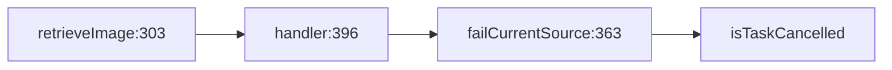

# Named local-function attribution

Cartograph now recovers the local consumer that the compiler index omitted in the
[previous comparison](2026-09-15-improvements.md). On the same six frozen questions,
exact consumer matching improves from **13/14 to 14/14**, with no extra consumers.
The earlier indexed enclosing-method projection is replaced only when source and
index evidence prove an actual local call or function-value reference chain.

For Kingfisher's `isTaskCancelled`, the selected chain is now:

`failCurrentSource` is the direct consumer, `handler` is at depth 2, and
`retrieveImage` is at depth 3. The outer method remains in transitive impact.
The full [before](2026-09-15-local-functions/before-query.json),
[after](2026-09-15-local-functions/after-query.json),
[depth-three](2026-09-15-local-functions/depth-three-query.json), and
[local-function query](2026-09-15-local-functions/local-query.json) documents make
that behavior inspectable. Local workspace prefixes are normalized in these artifacts.

## Evidence and scope

Both comparison arms are release builds with the same Apple Swift 6.4 toolchain
and index library. The baseline is the preceding reliability improvement build,
not the original unmodified release. Both binaries still print 0.13.0; their hashes
are recorded in the [measurements](2026-09-15-local-functions/results.json).
The pinned production sources, compiler indexes, include filters, and public-API
retention policy are unchanged.

| Project | Pinned revision | New local nodes | Existing unused diagnostics before / after |
|---|---|---:|---:|
| Alamofire | `bda9ed57d72988a3a2ada33d824583541f86eac6` | 0 | 21 / 21 |
| Kingfisher | `ab1c1de54a1ce1adfe1733c7195056a153029d3a` | 11 | 8 / 8 |
| Swift Argument Parser | `93c68882a28d9c82cd87be0acb7d76e35494b9b5` | 4 | 40 / 40 |

Across all three projects, every existing indexed node retains its metadata.
Contracting each synthetic local back to its original indexed owner reproduces
the original relationship kinds and weights exactly. Every promoted local has a
real call/reference entry chain from that owner. Full default **type, file, and
module graph documents are equal** before and after, including weighted edges.
These [checks](2026-09-15-local-functions/projection-verification.json) cover every
node and edge in the selected graphs, rather than only the six query targets.

The comparison runs before/after and then after/before. Each order measures three
sets of ten warmed MCP queries for every task and arm: 720 timed requests overall.
Both orders produce the same findings, graph counts, and query fingerprints.
Within each arm, repeated outputs/session identities are stable and CLI/MCP query
documents agree. Individual samples and medians are preserved in the measurements.
This follow-up establishes consumer specificity; it makes no new productivity,
market-advantage, or latency-improvement claim. No agent trial was repeated.
Pooled per-task warm query medians remained within 42–46 ms in both arms.

## Binding contract

- Reuse the already parsed SwiftSyntax tree. Do not run a second parser or the full
  value-flow analysis for ordinary graph queries.
- Require a unique exact indexed owner, physical UTF-8 source coordinates, and
  file-level source modification time no newer than the corresponding index unit.
  Modification time is checked around the source read.
- Identify named local scopes and unqualified references. Require a unique local
  name without parameter, variable, capture-alias, or nested-function shadowing.
  Start promotion only with actual owner references; self-recursion and mutually
  recursive locals alone do not establish an entry.
- Move only the compiler's existing call/reference occurrences from that exact
  owner at uniquely owned source-token locations. Keep their target identities,
  relationship kinds, and multiplicity. This also handles constructors, whose
  indexed `init` name differs from the source type name.
- Add actual local call/value-reference edges and lexical membership separately.
  Membership does not establish use. Anonymous closures retain their nearest
  named function owner.
- Re-enrichment first restores prior synthetic local ownership to the compiler
  projection, then checks current evidence again. Stale source cannot keep an old
  precise-looking local graph. Filters excluding calls, references, or membership
  also retain the original projection.

Synthetic keys use `cartograph:local-function:<ownerUSR>:<line>:<column>:<name>`
in the existing `usr` field, following the existing synthetic top-level-code
precedent. They are explicitly **Cartograph keys, not compiler USRs**. They can be
queried again, and they change if the local declaration's coordinates change.
No query JSON field or agent-skill text changed. Default dead-code grouping reports
the original unused owner instead of duplicating its promoted local descendants.
Symbol-level graphs can now expose actual recursion between promoted locals.

## Conservative remainder

Uncalled or recursive-only locals, shadowed/overloaded names, unsupported attributes,
macros, conditional compilation, malformed syntax, stale/unindexed/undated source,
and missing/unreadable files do not receive guessed local bindings. Property and
subscript accessor bodies are outside this initial support.

Kingfisher has **five observed local functions left at enclosing-index granularity**;
the response reports `local-function-projection` with that count. Its pre-existing
28/98 unindexed-source limitation also remains. These warnings describe the selected
project's actual evidence. A library-only macOS pilot does not establish complete
coverage of arbitrary applications, inactive targets, or runtime invocation paths.

## Verification

The initial unit test and real compiler corpus both fail with the old ownership
behavior. The revised corpus checks the exact local-to-outer depth chain and a
constructor called inside the local, alongside its complete existing dead/public/
bridge expectations. Regression tests also cover nested scopes, closures/function
values, shadowing, overloads, unsupported syntax, UTF-8 coordinates, stale reuse,
ambiguous owners, deterministic cached facts, graph rollups, and dead-owner grouping.

Final commands, counts, source/binary identities, and log hashes are recorded in
[verification.json](2026-09-15-local-functions/verification.json).

| Final check | Result |
|---|---|
| Full tests | **1,269 tests / 145 suites passed**. |
| Coverage gate | **92.98%** including actual CLI integration (26,946/28,979 lines); unit-only 86.76% (25,143/28,979); required threshold 90%. |
| Fresh build and CLI contract | Passed. |
| Actual compiler corpus | Passed, including local consumer depth and constructor attribution. |
| Self-analysis | `dead --strict`, module and type `cycles --strict`, and `rules --strict` all passed with no findings; actual limitations remain visible. |
| Final artifact identity | Current source manifest and measured release binary hashes match the verified artifacts. |

These measurements were captured from the working implementation on
`fix/analysis-query-reliability` before release preparation; no release or installation
was performed as part of that evaluation.

To reproduce the comparison, use `Scripts/benchmark-analysis-improvements.py` with
the frozen evaluation workspace, explicit before/after binaries,
`--consumer-granularity exact`, and both `--order before-after` and
`--order after-before` in separate output directories. Then run
`Scripts/verify-local-function-projection.py` against the comparison directory and
the same evaluation workspace to check every graph and the three-project dead delta.
