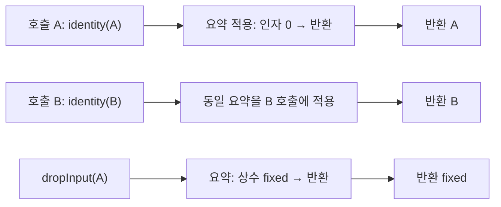

# 함수 간 데이터 흐름 점검 — 2026-09-08

> 이 문서는 0.9.0의 구현 전 기준선이다. 후속 값 흐름 구현과 동일 코퍼스의 실제 엔진 비교는
> [값 흐름 비교 보고서](2026-09-value-flow-comparison.md)를 참고한다.

**현재 Cartograph는 함수 사이의 호출·참조 도달성은 분석하지만, 인자에서 매개변수와 반환값을
거쳐 다른 호출로 전달되는 값은 추적하지 않는다.** 같은 파일의 불변 별칭 해석을 함수 간
데이터 흐름 분석으로 확대해서 설명하면 안 된다. 이번 변경은 범위 검증과 부정확한 한계 문구의
수정이며, 새 interprocedural 분석 엔진의 구현이 아니다.

## 실제 Swift 실행과 인덱스 비교

세 Swift 파일로 된 별도 패키지를 컴파일하고 실행한 뒤 동일 인덱스에 `query`와 `bridges`를
실행했다. 함수 정의와 호출은 다른 파일에 있다. Flutter API 형태의 스텁은 실제 선택된 채널
이름을 출력하므로 실행 값과 정적 관찰을 비교할 수 있다. Flutter 앱이나 원격 엔진 비교가 아니다.

| 입력 형태 | 실제 실행 값 | 브리지 이름 관찰 |
|---|---|---|
| 직접 `let control = "control"` | `control` | 정적 `control` |
| 함수가 리터럴 반환 | `literal-return` | `dynamic` |
| `identity("A")`, `identity("B")` | 각각 `A`, `B` | 각각 미상. 호출별 값 전파 없음 |
| 다른 함수를 다시 부르는 반환 | `literal-return` | `dynamic` |
| 함수 인자로 전달한 콜백 호출 | `callback` | `dynamic` |
| 재귀 반환 | `recursive` | `dynamic` |
| 프로토콜 수신자 호출 | `provider-A` | `dynamic` |
| `await` 반환 | `async` | `dynamic` |
| 입력을 버리고 상수 반환 | `fixed` | `dynamic`; 입력 영향 여부도 판별하지 못함 |
| 함수가 inout 인자를 변경 | `overwritten` | `dynamic`; 처음 값으로 잘못 확정하지 않음 |
| 등록 wrapper를 서로 다른 인자로 두 번 호출 | `wrapped-A`, `wrapped-B` | 소스 위치 하나의 미상 사실 |

실행 채널 이름은 13개, 소스의 method-handler 사실은 12개다. wrapper는 호출마다 실행되지만
생산자는 소스 위치 하나를 한 번 기록한다. 12개 중 직접 리터럴 대조군 하나만 정적이고,
나머지 11개는 미상으로 남는다. 두 identity 호출의 값을 모두 모르므로 문맥 민감 분석이
성공했다는 증거도 아니다. 향후 구현은 두 반환값을 구분하고, 입력을 버리는 함수도 구분해야 한다.

호출·참조 그래프는 이 하네스에서 다음을 확인했다.

- `main → runScenarios → middle → leaf` 경로가 실제 함수 경계를 따라 나온다.
- 콜백·재귀 함수 심볼은 `reachable`, 대조군 `unusedLeaf`는 `unreachable`이다.
- 사용한 ProviderA와 그 `name()`은 도달 가능하고, 사용하지 않은 ProviderB와 그 `name()`은 미도달이다.
- 콜백 심볼의 경로는 `runScenarios → callbackLeaf`다. 콜백을 전달한 참조는 보이지만,
  `callbackName`이 어떤 함수 값을 언제 호출하는지에 대한 값/호출 문맥 모델은 아니다.

## 현재 자료 구조가 보장하는 것

`IndexedReference`에는 source/target USR·간선 종류·소스 위치가 있다. 인자 번호, 매개변수 연결,
호출별 반환 노드, 필드 값 갱신 상태는 없다. `query.dependsOn`이나 도달성 경로는 이 심볼 관계의
사실이다. 함수 반환값이나 오염 값이 어느 인자에 도착했는지의 증명으로 읽어서는 안 된다.

`BindingCollector.constantString`은 표현식이 리터럴이거나 불변 별칭일 때만 따라간다.
함수 호출·await·연산자 결과를 만나면 미상이다. 이번에 확인된 동작은 숨겨진 값 전파 성공이
아니라, 해당 분석이 구현되어 있지 않다는 근거다.

채널만 미상이고 메서드는 `"run"`처럼 고정되어 있어도 `BridgeFact.isDynamic`은 참이다.
그런데 이전 `dynamic-method-names` 문구는 메서드 분기 자체가 비리터럴이라고 잘못 설명했다.
이를 **채널 또는 메서드 이름을 정적으로 해석하지 못한 사실 수**로 고쳤다. 채널 쪽도 생성자
실행 횟수로 표현하지 않고 등록 사실 수로 설명한다. 기존 limitation 키와 v1 판정은 유지한다.

## 공개 도구에서 참고할 부분

| 자료 | 확인한 기능/범위 | Cartograph에 필요한 요소 |
|---|---|---|
| [CodeQL Swift data flow](https://codeql.github.com/docs/codeql-language-guides/analyzing-data-flow-in-swift/) | 표현식·매개변수 노드, local/global flow와 taint 구분, source/sink로 분석 범위를 제한 | 심볼 그래프와 구별되는 값 노드 및 값 보존 관계 |
| [CodeQL Swift summary components](https://codeql.github.com/codeql-standard-libraries/swift/codeql/dataflow/internal/FlowSummaryImpl.qll/module.FlowSummaryImpl%24Make%24Private%24SummaryComponent.html) | 인자 위치·매개변수 위치·반환 종류·내용 접근을 summary에 표현 | 함수 요약을 실제 호출 위치의 인자와 반환 노드에 적용 |
| [Semgrep CE와 플랫폼 범위](https://semgrep.dev/products/semgrep-vs-ce/), [전파 용어](https://semgrep.dev/docs/writing-rules/glossary) | CE와 상용 함수/파일 간 분석 범위가 다르며, 미해석 호출에는 전파 모델이 필요 | 공개 엔진의 기능과 상용 기능을 섞어 주장하지 않는 범위 계약 |
| [Infer Pulse](https://fbinfer.com/docs/next/checker-pulse/) | 함수 요약·호출 조건·unknown/skipped calls를 다룬다. 문서의 Swift 지원 표시는 No | 알려지지 않은 호출과 부수 효과를 명시하는 설계 참고 |

이 도구들을 동일 코드에 실행한 정밀도/속도 순위가 아니다. 특히 Infer를 Swift 대체 엔진으로
검증한 것이 아니다. 공개 구현과 문서에서 분석 모델을 비교한 결과다.

## 다음 구현의 완료 기준 제안

다음은 현행 기능이 아니라, 위 자료와 재현에서 도출한 설계 제안이다.

1. **값 관계를 별도로 만든다.** 인자→매개변수, 반환→호출 결과, 필드 읽기/쓰기 노드와 근거를
   보관한다. 기존 `dependsOn`을 값 전파 관계인 것처럼 재해석하지 않는다.
2. **함수 요약을 호출마다 적용한다.** `identity`는 `parameter[0] → return`, 상수 함수는
   `constant → return`, 입력을 버리는 함수는 입력→반환 관계가 없다. 실제 callee USR을
   확인해야 하며 이름만 같은 함수·오버로드를 합쳐서는 안 된다.
3. **불명 값이 우선한다.** 모델 없는 외부 호출, 미해석 callback, inout/객체 변경, 가능한
   여러 수신자는 미상으로 남긴다. summary 캐시는 소스·빌드 구성·분석기 버전과 함께 무효화한다.
4. **재귀는 고정점과 예산으로 종료한다.** 강결합 요소별 요약을 갱신하고, 한도에 닿으면
   결과의 불완전성을 표시한다. 잘린 경로를 빈 정상 결과로 바꾸지 않는다.
5. **이 하네스를 양방향으로 바꿔 통과시킨다.** identity A/B가 섞이지 않고, 상수 반환과
   입력 버리기, callback과 protocol 후보, inout 효과가 구분되어야 한다. 그 전에 함수 간
   값 분석을 지원한다고 문서화하거나 미상 브리지를 정적으로 바꾸지 않는다.



## 재현

```bash
swift build
python3 Scripts/verify-analysis-blindspots.py .build/out/Products/Debug/cartograph
```

네트워크 없는 하네스가 상수·IB 검사와 위 함수 간 검사를 수행하고, 임시 디렉터리에 생성 소스,
실행 값, bridge-facts, 심볼 도달성 JSON을 남긴다. `--needle-source`는 별도의 Needle 검증 옵션이다.
현행 미상 결과를 고정한 검사는 지원 범위를 기록하기 위한 것이다. 이후 값 분석을 구현할 때는
기대값을 실제 호출별 값/관계로 바꾸고 대조군도 유지해야 한다.

검증: 728 tests, coverage 93.64%, CLI 계약·실제 인덱스 코퍼스·자기 분석(타입 순환 포함) 통과.
한계 문구 회귀는 수정 전 실패를 확인했고, 위 명령으로 실제 실행 값·12개 소스 사실·도달성
대조 검사를 통과했다. 선택적 Needle 검사도 기본·동적 모드에서 통과했다.
