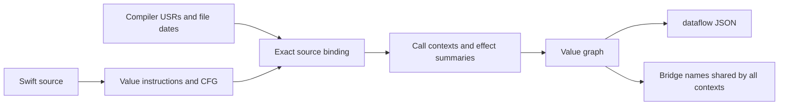

# 함수 간 값 흐름 비교 — 2026-09

이 문서는 `Fixtures/ValueFlowBenchmark`의 23개 사례를 같은 runtime oracle과 비교한 실측을
기록한다. 20개는 명시적인 origin-to-probe 관계이고, 세 개는 입력을 버리거나 외부 결과에만
영향을 주는 부정 사례다. runtime 문자열 값과 origin 관계는 별도로 비교했다. 예를 들어 입력을 버리고
`fixed`를 반환하면 입력 origin이 probe까지 보존되지 않았으므로 이 표에서는 부정 사례다.

이 자료는 Swift 전체 기능 범위나 엔진 순위를 주장하지 않는다. 코퍼스에 없는 문법과 라이브러리
호출은 이 표에서 측정되지 않는다.

## 고정한 입력과 도구

코퍼스는 SwiftPM 실행 파일 하나이며 `probe(label:value:)`가 `label=value`를 출력한다. 함수 정의와
호출은 `Support.swift`, `LocalScenarios.swift`, `main.swift`에 나뉘어 있다. oracle은
[`Fixtures/ValueFlowBenchmark/expected.json`](../../Fixtures/ValueFlowBenchmark/expected.json)에
있다.

| 항목 | 값 |
|---|---|
| Host | macOS 26, arm64 |
| Swift | Apple Swift 6.4.0, clang 2100.3.27.1 |
| Cartograph | 0.9.0 기반 `feat/interprocedural-value-flow` 개발 트리 |
| Semgrep | 1.164.0 OSS engine |
| CodeQL CLI | 2.26.4, 별도 배포 binary CLI |
| CodeQL Swift queries | `codeql/swift-queries` 1.3.9 |
| CodeQL Swift library | `codeql/swift-all` 6.8.2 |
| CodeQL database support boundary | pack changelog는 Swift 6.3.3 지원을 명시하지만, 이번 성공 실행은 Swift 6.4에서 수행됨 |

입력 파일 SHA256은 다음과 같다. 경로는 저장소 상대 경로만 기록한다.

| 파일 | SHA256 |
|---|---|
| `Fixtures/ValueFlowBenchmark/Package.swift` | `51165893941dea8eed027e4c1332f53aecd7202ab0fa03b6b4f8512992af300b` |
| `Fixtures/ValueFlowBenchmark/expected.json` | `d879fe905d1b239ff02d73541a29cba6e866d989aa95a2b07dd4e905f268c0f4` |
| `Fixtures/ValueFlowBenchmark/Sources/ValueFlowBenchmark/LocalScenarios.swift` | `5cfb7c8609b789963cf0d32199e75f325729c394a306a059b59bd68329b84082` |
| `Fixtures/ValueFlowBenchmark/Sources/ValueFlowBenchmark/Support.swift` | `96fd5a494c4818bfe71fc1f3e209430e7de86d443c53a01f5e92c5efe0433b29` |
| `Fixtures/ValueFlowBenchmark/Sources/ValueFlowBenchmark/main.swift` | `1b8bf4517622501fc047a05ccbcc565e0cb7bee21be782a208bc6047fcb7dafa` |

Semgrep는 taint, literal, union을 따로 보고했다. CodeQL은 global value flow, taint flow,
직접 literal constant 관찰을 서로 다른 query로 실행했다. CodeQL CLI는 공개 QL library와
구분해야 한다. CLI의 license와 배포 조건은 QL pack의 공개 소스 조건과 동일하다고 간주하지
않았다. Infer Pulse는 설계 참고 자료로만 남겼고 Swift 직접 실행 점수에는 포함하지 않았다.
관련 공개 자료와 설계 한계는 [함수 간 데이터 흐름 점검](2026-09-interprocedural-flow.md)에
정리되어 있다.

## 결과

### Semgrep CE

독립 재검증 결과는 `taint_only`와 `union` 모두 다음과 같았다.

| 측정 | TP | FP | FN | 조건 |
|---|---:|---:|---:|---|
| taint-only | 11 | 4 | 9 | Semgrep OSS 1.164.0, 3회 반복 |
| literal-only | 1 | 0 | 19 | 직접 literal sink 관찰 |
| union | 11 | 4 | 9 | 같은 결과 집합의 중복 제거 |

runtime build는 7.35초, runtime 실행은 0.36초였다. Semgrep 실행 시간은 3.83초,
2.51초, 2.16초였고 세 결과의 parser 상태와 파일 집합이 안정적이었다. 이 결과는 Semgrep의
Swift CE taint 결과를 값 보존 증명으로 읽을 수 없다는 코퍼스 근거다.

### CodeQL

CodeQL database 생성은 별도 fresh SwiftPM build에서 148.55초였다. database finalize와
TRAP import가 완료됐으며, timeout이나 extraction error는 없었다. query compilation도 별도
측정했다.

| query | compile | 1회 | 2회 | 3회 | 결과 안정성 |
|---|---:|---:|---:|---:|---|
| value flow | 1.19초 | 5.53초 | 2.44초 | 2.49초 | stable |
| taint flow | 1.05초 | 2.85초 | 2.45초 | 2.46초 | stable |
| direct constants | 0.90초 | 1.91초 | 1.93초 | 1.88초 | stable |

value flow와 taint flow 모두 oracle의 20 positive pair를 정확히 찾았다.

| 측정 | TP | FP | FN |
|---|---:|---:|---:|
| CodeQL value flow | 20 | 0 | 0 |
| CodeQL taint flow | 20 | 0 | 0 |

direct constants query는 `literal-inline-A=origin-A`를 관찰하는 별도 결과이며, 이를 20개
interprocedural origin pair 점수에 합치지 않았다. 독립 재검증은 해당 CSV가 원본 실행의 CSV와
일치하는지 확인했다. 동시 부하가 있는 별도 재실행은 value flow 3.75초, taint flow
5.45초, constants 2.13초였으므로 cold/warm 단독 실행 시간과 섞지 않는다.

### Cartograph

새 `dataflow` 명령은 3회 모두 같은 결과를 냈다. 23개 probe를 모두 분석했고 예산 초과나
파싱 오류는 없었다. 값 보존 관계는 **TP 20, FP 0, FN 0**이다. 확정 가능한 runtime 문자열
22개는 실행 결과와 모두 일치했다. Foundation의 Base64 성공 여부에 따라 선택되는 나머지
한 개는 두 가능한 고정 문자열로 남겼으며 하나로 확정하지 않았다.

SwiftPM 빌드와 컴파일러 인덱스 생성은 4.69초였다. 인덱스 읽기·구문 낮춤·USR 결합·고정점 계산·
JSON 출력까지 포함한 CLI 실행은 1.36초, 0.83초, 0.85초였다. 별도 검증 빌드가 함께 실행되던
환경의 벽시계 시간이다. CodeQL의 database extraction이나 warm query 시간과 동일 작업량으로
간주해 속도 배수를 계산하지 않는다. 세 실행 모두 소스를 다시 읽고 새 요약 캐시를 만들었다.

`selectedContexts`에 포함된 probe 문맥만 채점한다. 정상적인 알려진 문자열과 `unknownReasons`가
함께 있는 값은 확정 문자열로 세지 않는다. 실행 실패·불안정한 결과·잘린 분석·누락 label은
미채점으로 표시하며 0점으로 비교하지 않는다. 미상 값은 따로 기록하고 회수하지 못한 관계는
FN으로 센다. 동일한 문자열이 입력과 반환에 우연히 나타난다는 이유로 입력→반환 간선을 만들지 않는다.

## 구현과 별도 회귀 검증



CodeQL에서 참고한 값 노드·값 보존 관계의 분리를 별도 IR과 인자→매개변수·반환→호출·메모리
간선으로 구현했다. 요약은 호출 경로, 인자, 캡처, 수신자, 관련 메모리와 외부 노출 상태를 구분한다.
재귀는 작업 목록의 고정점으로 처리하며 호출·반복·값·메모리 예산을 출력한다. Infer Pulse에서
참고한 요약·부수 효과·미상 호출의 구분은 inout/필드 변경 전후와 보수적인 메모리 무효화에 반영했다.
이는 두 엔진의 구현을 그대로 이식했거나 Swift 전역 오염 분석을 완성했다는 뜻은 아니다.

별도 Swift 실행 하네스는 13개 실행 채널과 12개 소스 핸들러 사실을 비교한다. 리터럴 반환,
identity A/B, 중첩 반환, callback, 재귀, protocol witness, async, inout, 입력을 버리는 반환의
이름이 실행과 일치한다. wrapper의 `wrapped-A`/`wrapped-B`는 `dataflow`에서 별도 문맥이다.
기존 브리지 교환 형식은 같은 소스 위치에 한 사실을 기록하므로 그 위치는 동적으로 유지한다.

커스텀 `ExpressibleByStringLiteral` 변환과 `StaticString`은 실제 컴파일에서도 일반 String
상수로 승격하지 않는 것을 확인했다. 소스 문자열은 타입 문맥을 입증한 뒤에만 값으로 사용하며,
컴파일러의 암시적 리터럴 변환 증거도 확인한다. 신선도는 전체 인덱스 시각 대신 파일별 유닛
시각을 사용한다. SwiftPM 매니페스트는 실행 프로그램의 전역 상태에 포함하지 않는다.

독립 검토의 메모리 반례를 회귀 테스트로 고정했다. 외부 콜백의 캡처, 미지원 본문의 inout 효과,
외부 진입점의 전역 상태, 미지원 생성자/인자 불일치의 효과, 약한 쓰기와 분기 합류의 간선,
예산 초과의 끊어진 간선을 검증한다. 재귀 연산의 주소 누적 수정을 되돌렸을 때 테스트가
실제로 실패하는 것도 확인했다.

현재 범위는 String 값을 중심으로 한 유한한 정적 분석이다. 모델 없는 SDK 호출, 미해결
리터럴 타입/alias, 가변 값 타입, 상속 생성자, 동적 class 멤버, 매크로·프로퍼티 관찰자,
미지원 제어문은 미상으로 남긴다. 기본 연산자도 일반적인 계산 결과를 평가하지 않으며,
분기에서 가능한 반환값을 합친다. 이 코퍼스 밖의 Swift 전체 정확도를 보장하지 않는다.

```bash
python3 Scripts/verify-analysis-blindspots.py .build/out/Products/Debug/cartograph
```

## 저장소 검증

802 tests와 coverage 90.38%를 통과했다. CLI 종료 코드 계약, 실제 인덱스 픽스처, 빌드 및
`dead`·모듈/타입 `cycles`·`rules --strict`도 모두 통과했다. 변경은 개발 브랜치의 작업트리에
있으며 아직 정식 릴리스에 포함되지 않았다.

## 조건과 재현

각 엔진은 같은 저장소 상대 코퍼스를 사용하지만 build/extract/query 측정 조건은 다르다.
SwiftPM build와 runtime은 별도 scratch path에서 한 번 수행한다. Semgrep는 build/runtime 후
3회 extraction을 하고, CodeQL은 database extraction, query compile, query run, BQRS decode를
분리해 3회 반복한다. cold database extraction, warm query cache, 동시 부하 측정은 서로 다른
조건으로 표기한다.

Semgrep:

```bash
python3 Scripts/benchmark-semgrep.py \
  --corpus Fixtures/ValueFlowBenchmark \
  --semgrep /path/to/semgrep \
  --runs 3 \
  --output-dir Fixtures/ValueFlowBenchmark/.benchmark-results/semgrep
```

CodeQL:

```bash
python3 Scripts/benchmark-codeql.py \
  --codeql /path/to/codeql/codeql \
  --corpus Fixtures/ValueFlowBenchmark \
  --build-method swiftpm \
  --runs 3 \
  --timeout 600 \
  --output-dir Fixtures/ValueFlowBenchmark/.benchmark-results/codeql
```

Cartograph:

```bash
python3 Scripts/benchmark-cartograph.py \
  --cartograph /path/to/cartograph \
  --corpus Fixtures/ValueFlowBenchmark \
  --runs 3 \
  --output-dir Fixtures/ValueFlowBenchmark/.benchmark-results/cartograph
```

`/path/to/...`는 설치 환경의 placeholder다. 결과를 공유할 때 개인의 임시 디렉터리나 사용자
이름이 들어간 절대 경로를 복사하지 않는다. raw stdout/stderr와 전체 JSON은 evidence 디렉터리에
남기고, 커밋하는 표에는 버전·architecture·SHA256·상대 경로만 적는다.

이 세 도구의 결과로 Swift 전체 문법 지원률, 전체 프로젝트의 soundness, 또는 엔진 순위를
주장하지 않는다. 이 문서는 이 코퍼스와 명시된 실행 조건에 대한 비교 기록이다.
